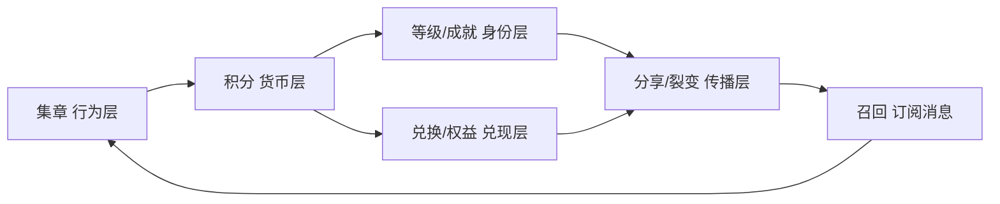

# 严选市集追场神器 · 项目落地规划

> 一份自包含的立项 + 落地文档，可直接搬入新工程作为 README / 规划书。
> 定位：为「晋江严选」这类**跨镇街巡回的线下市集 + 商家联盟**打造一个数字化「追场 + 留客 + 忠诚度运营」工具。
> 作者视角：一个 Java 后端 + AI 工具，独立完成 demo 与 MVP。
> **重要前提：本文所有商业方向结论，在真实验证付费意愿前都属于"假设"，务必先做第零章再动手。**

---

## 零、先验证需求，再动手（最重要的一章）

在写任何重代码之前，必须先回答一个问题：**对方到底需不需要、愿不愿意付钱？**
本地小程序十个有九个是"僵尸"，最大的风险不是做不出来，而是**做了个没人要的东西**。

### 0.1 三个必须承认的现实
1. **抖音可能已经够用**：场次信息用抖音置顶/合集/粉丝群/公众号就能发，成本几乎为零；
2. **收款码已解决金额与分红**：老板的统一收款码已经能看到流水、金额、按此分红——**这块别去碰、也别重复做**；
3. **本地小程序极易变僵尸**：办完市集就凉是常态，不是你做得好就能例外。

### 0.2 验证清单（零成本，花几个晚上）
- 去一场市集现场，**只观察 + 闲聊，不推销**：随机问 5~10 个游客"你怎么知道今天有市集？之前想来过吗、怎么找到的？"
  - 都说"刷抖音刷到、差点错过" → 痛点**真**；都说"我住隔壁早知道" → 痛点**伪**。
- 想办法跟老板/博主搭上一句话，**只问不推**："你们这么多场次、这么多合作商家，粉丝会不会经常问'下一场在哪、这个哪儿买'？你们现在怎么回的？"
  - **他的抱怨程度 = 付费意愿的温度计。**
- **一句关键验证问话**（决定"数据/留客"这套卖不卖得动）：
  > "你收款码能看到卖了多少钱，那你知不知道**有多少人来过、又有多少人变成回头客**？你关心这个吗？"
  - 眼睛一亮"我一直想知道" → 有戏；"我只管收钱分红，别的虚的不要" → **止损**。

### 0.3 三条止损线
1. **没拿到明确"我愿意付钱"的信号前，不写重代码**（demo 三页除外，那是筹码不是投入）；
2. **给验证设次数上限**：搭话/观察 N 次仍无真实痛点信号 → 停；
3. **绝不自己垫钱**做奖品/推广——那是对方该出的，你只出技术。

### 0.4 把两个问题分开
- **问题 A：晋江严选需不需要？** → 待验证，可能不需要；
- **问题 B：这事对你个人有没有价值？** → 就算严选不买，几天用 uni-app 做出的 demo 也是**作品集里一个有商业思考的项目**，框架还能复制给其它本地活动。
- **正解 = 控制投入**：demo 时间盒死死卡在几个晚上（三页 + mock，不做后台/支付），最坏也只是练手，谈不上浪费。

---

## 一、项目背景

### 1.1 合作对象画像
- **晋江严选**：由**商协会背书 + 抖音博主带火并发起**的本地农特产品集合品牌与线下市集 IP，靠短视频引流。
- **市集形态**：**地点不固定、跨镇街巡回**——可能在水头、安海、青阳、东石、石井等地轮办（水头、石井属南安市，其余属晋江，实为**跨市巡回**）。
- **现金流特征**：活动型、不稳定，非大厂预算，对一次性大额开发费敏感。
- **我方处境**：无本地商户/政府资源，仅能通过抖音联系到博主，以**技术方身份**切入。

### 1.2 核心痛点（产品的立身之本）
巡回市集最要命的问题**不是好不好吃，而是"粉丝找不到下一场、来了留不住"**：
1. 抖音发"明天东石开市"，粉丝刷到已是当天，赶不上；
2. 老粉记不住这周在哪办；
3. 每到一个新镇街，本地人不知道市集来了；
4. **市集一散，人气就没了**——一次性游客无法沉淀为可复购/复访的用户。

> **关键判断**：抖音解决不了「结构化场次信息 + 订阅提醒 + 忠诚度运营 + 用户沉淀」，收款码只记「成交了多少钱」，**这两者都做不到"把人留住、让人反复回来"，只有小程序能**。"地点不固定"不是麻烦，恰恰是小程序最硬的刚需。

### 1.3 更大的生态：这是一个"本地生活商家联盟 + 抖音矩阵"
严选老板并非单纯"市集摊主"，而是**操盘一个联盟的"盟主"**，实为三层结构：

| 层 | 角色 | 干什么 |
|---|---|---|
| **流量引擎** | 严选老板 + 多个合作博主的**抖音矩阵** | 联合发布、互相导流、产品介绍、闽南习俗典故视频（养号/立人设/建本地文化认同） |
| **线下聚合场** | **严选市集** | 把线上流量导到线下，跨镇街巡回，制造事件和人气 |
| **变现/供给节点** | 家具城、装修公司、家电商城等**实体老板** | 联盟成员，靠抖音曝光 + 市集引流获客，是客单价更高、更愿付费的金主 |

- "严选"是一个**品牌伞**，美食市集只是最出圈的那条线；家具/装修/家电才是**高客单、强付费意愿**的变现节点。
- **联盟最缺的一环**：有大量抖音内容、大量线下商家、大量本地流量，**但没有"把抖音流量沉淀下来、把分散老板串成可复购网络"的私域中枢**——抖音粉丝是"平台的"，市集散了人就走了。**这正是小程序能补、且比"追场神器"值钱十倍的位置。**

> **战略含义**：产品天花板从"给一个博主做工具"抬升为"给一个联盟做中枢"；但盘子越大，决策方越多、周期越长、资金合规风险越深（详见第八章红线）。

---

## 二、产品定位与核心价值

**一句话定位**：**抖音负责"种草引流"，收款码负责"收钱分红"，本产品负责中间那一层——把人吸引来、留住、变成追着市集和联盟跑的回头客。**

> **不碰收款码 / 分账**：金额统计与商户分红已由老板的统一收款码解决，本产品**只做它前面的"客流引流层"**，给收款码多喂客户，两者是接力不是竞争。

| 角色 | 本产品给他的价值 |
|------|------------------|
| **游客 / 粉丝** | 一眼看到下一场在哪、几点、有啥；一键导航；订阅提醒；集章护照玩遍闽南各镇 |
| **博主 / 盟主** | 把一次性游客沉淀成可复访/复购的私域用户；看见客流漏斗与回头客数据（收款码看不见）；抖音之外主动召回 |
| **摊位 / 联盟商户** | 集章把游客引导到每个摊位；核销即曝光；严选好物线上复购入口；联盟内积分通用 |

**升级概念**：因市集跨晋江 + 南安，可包装为 **"跟着严选市集游闽南"**——用一场场市集，串起闽南一个个镇街的吃住逛。

### 2.1 产品能"打脸抖音和收款码"的独有能力（demo 每个功能都要对应其一）
| 能力 | 抖音 / 收款码为什么做不到 |
|---|---|
| 随时查下一场 + 一键导航 | 抖音是信息流，刷过就没；无法"随时查、点一下导航" |
| 订阅提醒（开市主动推送） | 抖音不能给单个粉丝推"你要的那场开了" |
| **集章护照（跨场次累积+可视化）** | 抖音、群、收款码**完全没有**——这是杀手锏 |
| 专属分享卡片 | 抖音转发的是视频，不是"我的打卡战绩" |
| **客流漏斗 + 忠诚度 + 召回** | 收款码只看到"成交之后"，看不到"人怎么来、来了几次、怎么召回" |

---

## 三、功能规划

### 3.1 核心：六层游戏化忠诚度系统（产品护城河）
**"追场"是把人吸引来的入口；"集章 + 积分 + 等级 + 兑换 + 召回"才是把人留住、让人反复回来的引擎。** 这套系统抖音和收款码都给不了，是"必须定制小程序"的真正理由。



| 层 | 机制 | 玩法 | 落地难度 |
|---|---|---|---|
| **行为层** | 集章 | 多维度：按镇街/场次/商户/品类；触发：扫码盖章、LBS定位打卡、消费核销盖章 | 低（二维码+云函数，防重） |
| **货币层** | 积分 | 获取：签到/集章/消费/分享；消耗：兑换/抽奖/抵券。**积分是跨商家通用的黏合剂** | 低（一张流水表，后端强项） |
| **身份层** | 等级/称号/成就/排行榜 | 市集新手→闽南通→严选铁粉；徽章：集齐5镇/连续3场；铁粉榜激发攀比 | 中（可配置规则引擎） |
| **兑现层** | 兑换/优惠券 | 积分商城换严选好物/文创/商户券；联合券多商户通用；集满抽奖 | 中（**权益由商户出、核销在商户**） |
| **传播层** | 分享/裂变 | 战绩卡片、邀请好友得积分、组队集章 | 中（分享卡片真机适配有坑） |
| **召回层** | 订阅消息 | 新场次提醒、积分到期、"你差一枚章就通关" | 低（模板配置+审核略烦） |

> **最外一层 = 联盟会员通**：同一套集章/积分/等级/权益扩展到家具/家电/装修商户，市集攒的积分能去家电商城用，把散兵游勇的老板们绑成一张网。

### 3.2 交付面：这不是"一个小程序"，是四个端
**一个人做，最容易被低估的就是"小程序之外"的部分——后台往往比前端还重。**

| 端 | 内容 | 工作量占比 |
|---|---|---|
| **用户端小程序** | 追场/集章/积分/兑换/分享 | 基准 ×1 |
| **商户端** | 核销兑换、看自己的数据（联盟阶段多商户） | 常被忽略，又一个端 |
| **运营管理后台** | 发场次、录摊位、管商户、配积分规则、管兑换、**审核评论**、看客流漏斗看板、发订阅消息 | **往往比小程序本身还重（×1.5~2）** |
| **UGC 评论系统** | 发布/展示/点赞/举报 + **微信内容安全审核** | 看着小，藏地雷（见 4.4） |

> **结论**：完整交付面 ≈ 小程序 ×2.5。工期不能只按"用户端"估（见第五章）。

### 3.3 分阶段落地

**阶段一：H5 Demo（敲门砖，零成本）**
目的：证明玩法 + 证明自己能做，拿去市集现场当面谈。**不涉支付、不涉后台、不涉真实数据、评论不做。**
- 页面 1 · **下一场在哪**：大字"下一场：X日·东石"+倒计时；巡回时间轴（已办/本场/预告）；一键导航 + "提醒我"（占位）。
- 页面 2 · **本场摊位地图**：本场摊位/美食/严选好物分布；结合在地特色（水头石材海鲜、安海土笋冻捆蹄…）。
- 页面 3 · **打卡护照**：跨场次集章，亮章 vs 灰章，"再集3个镇解锁达人"；一键生成漂亮**分享卡片**。
- 页面 4（老板视角，mock）· **客流漏斗看板**：多少人查了下一场→多少人点导航→多少人集满3章复访→私域可召回人数。**配文"抖音后台告诉你视频多少人看，但告诉不了你多少人真来了、来了几次"。**

> demo 三原则：① **用他的真实数据**（真实场次/镇街/合作商家名，不用占位符）；② **视觉别用程序员审美**（抄现成排版 + AI 生成素材 + 成熟 UI 库）；③ **现场用他的手机扫码打开、让他亲手滑**。

**阶段二：小程序 MVP（谈成后正式版）**
只做能让闭环转起来的**最小可玩闭环**：**集章 → 积分 → 简单兑换/称号 → 分享卡片**。
- 微信小程序发布（uni-app 同套代码编译）；微信登录；订阅消息；扫码集章 + 核销；
- **基础运营后台**（用若依 RuoYi 生成，见 4.2）：发场次、录摊位、看客流漏斗；
- **评论暂缓**，或只做"只读展示官方内容 + 用户晒图走后台先审后发"，**不做开放社区**（太重）。

**阶段三：完整版（可复购 / 可规模化）**
- 严选好物线上下单 + 微信支付 + 邮寄（**需企业资质，靠合作方主体**）；
- 商户端 + 完整等级/成就/排行榜 + 联合券 + 抽奖；
- 开放评论 + 内容安全审核全套；客流漏斗看板完善。

**阶段四：联盟平台化（把工具长成中枢）**
- **跨商家统一集章/会员/积分**：市集积分在家具城、家电商城、装修公司通用；
- **联合优惠券/联合活动**：抖音一发、小程序一领、到店一核销；
- **抖音内容私域沉淀**：闽南习俗典故、产品介绍视频聚合进小程序；
- **高客单商家留资预约/咨询**：装修、家具承接；
- **商业模式升级**：按入驻商家数收费（入驻费/年费）或按核销/成交抽成。

> **推进节奏（务必小切口进）**：单点市集先谈成落地 → demo 里埋一句"这套集章/积分体系以后家具城、家电商城都能接入、联盟内通用"，**让盟主自己意识到可复制** → 再扩到 1~2 个高意愿老板（如家电）→ 最后谈统一会员/联合优惠。**每扩一步都是一笔新收入，且让盟主觉得是他在扩张，不是你在吹牛。**

---

## 四、技术选型

### 4.1 前端：uni-app（强烈推荐）
- **一套代码，双端编译**：demo 编成 H5 发微信链接演示；谈成后同套代码补功能，编译成微信小程序交付，**demo 代码不浪费**。
- Vue 语法，对 Java 后端出身者上手最顺，国内小程序生态默认选它。
- UI 用成熟库（uView / uni-ui），**别自己从零设计**。

### 4.2 后端：两条路线，因"要不要重后台"而定
| 路线 | 后台怎么做 | 优点 | 缺点 | 适合 |
|---|---|---|---|---|
| **微信云开发 CloudBase** | 用云开发 CMS 扩展或自己撸 admin | 免服务器/运维/备案，对小程序原生友好 | **重后台没有生成器，得自己搭**；绑定微信生态 | 后台很轻时 |
| **Spring Boot + 若依 RuoYi** | RuoYi（Spring Boot+Vue）**后台 CRUD 生成器**，配好表→增删改查/权限/菜单几乎自动生成 | **后台等于白送，正好吃你的 Java 老本** | 要自己搞服务器/域名/HTTPS/备案/运维 | **本项目：明确要重后台 + 评论审核，倾向此路线** |

> **修正建议**：早期倾向云开发（假设只有轻后台）。但既然明确要做**运营管理后台 + 商户端 + UGC 评论审核**，后台工作量很重，**Spring Boot + 若依 RuoYi 的自动 CRUD 生成能把最重的后台几乎白送，对 Java 后端的你优势压过云开发的免运维**。demo 阶段仍**无后端**（纯 uni-app + mock JSON）。

### 4.3 数据模型骨架
```jsonc
// —— demo 阶段 mock JSON ——
// markets.json 市集场次
[{ "id":"m001", "town":"东石镇", "city":"晋江", "venue":"XX广场",
   "location":{"lat":24.7,"lng":118.5}, "startDate":"2026-10-03", "endDate":"2026-10-05",
   "status":"upcoming", // done/ongoing/upcoming/tbd
   "specialty":"海鲜、紫菜、本地小吃",
   "stalls":[{"id":"s1","name":"阿婆土笋冻","type":"food","mustTry":"土笋冻","tag":"本地人认证"}] }]

// —— MVP/正式版 数据库表（后端主场）——
user            { openid, nickname, level, pointsBalance }
stampRule       { id, type:"town|market|merchant|category", targetId, points, icon, condition } // 可配置
userStamp       { userId, stampRuleId, marketId, town, merchantId, stampTime }  // 唯一约束防重
pointsLedger    { userId, change:+/-, reason:"stamp|signin|share|exchange", refId, time } // 只追加，余额=累加
reward          { id, name, costPoints, stock, provider:"商户/联盟", type:"实物|优惠券" }
userExchange    { userId, rewardId, time, status:"待核销|已核销", verifyMerchantId }
achievement     { id, name, condition, badge }
userAchievement { userId, achievementId, unlockTime }
comment         { id, userId, targetId, content, status:"待审|通过|驳回", secCheckResult } // 见 4.4
```

### 4.4 UGC 评论的内容安全红线（隐藏地雷）
只要小程序里有用户能发文字/图片的地方（评论、晒图、昵称），**微信强制要求接入内容安全接口（msgSecCheck / imgSecCheck）做机审**，否则：
1. **审核直接不给过**（硬门槛）；
2. 用户发违规内容，**法律与责任在你和运营方**；
3. 还需配**后台人工审核 + 删帖 + 举报处理**一整套。

> **对策**：MVP 阶段**评论先不做或只做只读/先审后发**，别做开放社区；开放评论留到验证成功、收了钱之后再迭代。

### 4.5 资金红线
- **可做（不碰钱）**：信息聚合、集章、积分记账、优惠券核销（券由商户出、在商户核销）、留资预约；
- **禁止（碰钱）**：跨商家资金分账、平台代收代付、积分抵现金/预付充值——**涉及资金合规与法律风险，超出单人承载能力，交给有资质的支付服务商或干脆别做**（收款码那套已解决金额与分红）。

---

## 五、落地路线图与工期（含后台的诚实校准）

| 阶段 | 内容 | 工期（业余） | 依赖 |
|------|------|--------------|------|
| **P0** | uni-app 环境 + 4 页 H5 demo（含客流漏斗 mock）+ mock 数据 | **3~7 天** | 无，你自己就能做 |
| **P1** | 拿去市集现场找博主谈合作（见第七章话术 + 第零章验证） | 视机会 | demo |
| **P2** | 小程序注册 + 主体认证 + 后端/若依脚手架 | 1~2 周 | **需营业执照主体** |
| **P3** | **MVP 正式版**：用户端小程序 + 后端 + 集章积分兑换分享 + 基础运营后台（若依生成），**评论暂缓** | **6~10 周** | P2 + 合作方确认 |
| **P4** | 加商户端 + 完整后台 + 评论（含内容安全审核） | **再 +4~8 周** | 视需求 |
| **P5** | 完整版：支付 + 线上下单 + 联盟通用 + 数据看板 | 数月，分期迭代 | 需微信支付资质 |

> 前提：边学 uni-app 边做；全职做工期约减半。**别想一口吞完整六层 + 联盟，一口吞会被噎死。**

---

## 六、商业模式与报价

### 6.1 行情锚（一次性开发市场价）
| 档位 | 内容 | 市场价 |
|------|------|--------|
| 纯 demo / H5 | 地图 + 路线 + 分享卡片，无后台 | 3千 ~ 8千 |
| 标准版 | + 集章积分兑换 + 基础后台 | 1万 ~ 3万 |
| 完整版 | + 商户端 + 会员 + 评论 + 下单邮寄 + 数据后台 | 3万 ~ 8万 |

> 外包公司接此类活通常报 2万~5万；个人接可略低，但**别贱卖到几千块**，尤其对方是商协会/有规模时，报太低反显不专业。**注意：含重后台 + 评论后，工作量是纯小程序的 2.5 倍，报价要匹配。**

### 6.2 四种收费结构（从稳到赌）
- **A 一次性买断**：1.5万~3万（含后台/评论应往高）。最稳，但他最可能嫌贵；钱货两清，后续爆火与你无关。
- **B 低价 + 年费/维护费（最推荐）**：首年开发 8千~1.5万，之后 3千~8千/年维护。降低对方掏钱门槛，给你持续可预期收入；市集反复办、后台要改，正好收维护费。
- **C 低开发费 + 分成**：换线上带货 GMV 或核销转化分成（3%~5%）。**只在有可信结算机制时用**——数据在他手里，难核实，风险最大。
- **D 技术合伙 / 入股**：换名分或股份。**除非明确要成立公司/融资，否则别为虚名放弃真金白银。**

### 6.3 报价策略（分两步，别一次亮底牌）
1. **先做零成本 demo，不谈钱**，先让他看见价值、认可你这个人。
2. **用模式 B 打底报价**：
   > "开发我收 1万（首年），之后每年 5千维护。集章积分兑换、商户核销、后台都在里面。"
   - 嫌贵 → 退到"标准版 8千，完整功能后续按需求单加"；
   - 很有钱想买断 → 报 2.5万~3万一次性；
   - **张口就要"免费做、以后分你点" → 坚决要一笔保底开发费，否则拒绝白干。**

### 6.4 三条保命底线
1. **一定收定金**：签合同付 50%、交付付 50%（5-5 或 5-3-2）。个人接单最大的坑是"做完钱要不回来"。
2. **代码归属 / 维护边界写清**：哪些免费维护、哪些算新需求另收费，白纸黑字，**防止需求无限膨胀被薅**（老板一句"再加个抽奖"，一个人扛不住无限加）。
3. **别为"股份/分成"放弃保底开发费**：宁要确定的 1 万，不要虚的 20% 分成。

---

## 七、合作与推广策略

### 7.1 关键认知：抖音博主大概率"看不上"小程序（去谈前必须想清楚）
- 他活在抖音、钱也在抖音，你推微信小程序，他听着像"要我把粉丝导到微信"→ 天然抵触；
- 市集是"活动"不是"长期产品"，他未必有耐心做慢工；
- 他身边不缺人搭讪，你一个陌生程序员凭什么让他停下来听。

> **破解之道**：把产品定位成"帮他在抖音之外多一条腿、承接抖音流量、让粉丝更愿意复购"，而非"取代抖音"；且**明确不碰他的收款码和分红，只做前面引流的一层**。

### 7.2 打开方式（别一上来谈"我给你做个小程序"）
1. **去线下市集现场当面聊**，胜过线上私信 100 次（线上私信 99% 石沉大海）。
2. **开场谈"我发现了你的一个问题"**，不谈技术：
   - "我逛完一圈，游客根本不知道哪个摊值得吃、怎么走不冤枉路"；
   - "买完土笋冻想寄回家，现场没地方下单邮寄，走了就断了"；
   - "市集一散人气就没了，你们没把来的人留下来复购"。
   → 让他点头"对对对"，你才拿到继续聊的门票。
3. **掏 demo 而不是空口**："你看，我已经做了个游客能用的东西"——让你从"又一个推销的"变成"一个真做事的人"。

### 7.3 谈成的核心话术
> "你的市集到处跑，粉丝最大的问题是不知道下一场在哪、赶不上、留不住。
> 收款码能告诉你卖了多少钱，但告诉不了你**多少人来了、来了几次、怎么再叫回来**。
> 我给你做个东西：下一场一键导航 + 开市自动提醒 + 来一场盖一个章 + 集满几个镇换好礼 + 积分在联盟商户通用，还能反复推送召回。
> **抖音负责种草，收款码负责收钱，我负责把人留住、变成回头客，给你的收款码多喂客户。这些抖音和收款码一个都给不了。**"

### 7.4 成本与铺店：别自己扛
- **集章奖品**：用严选自家商品（捆蹄、菜粿、手信），对他们是促销成本而非白送；或商协会用"文创采购"名义买单。
- **推广铺店**：商户是天然推广员（扫码集章 = 给商户带客流），桌贴二维码物料成本极低，谈的是"愿不愿意摆"。
- **你的角色**：技术方 + 产品设计，**不是投资方、不是地推团队**。

### 7.5 别把赌注全压在一个博主身上
demo 本身有价值：谈不成博主，还能拿去找**镇政府文旅办、安平桥管委会、其它本地商户/活动**——安海世遗 IP 摆在那，愿接的人不止他一个。

---

## 八、"一个人 + AI"可行性评估

### 8.1 按模块拆工作量（后端 + AI 视角）
| 模块 | 难度 | 说明 |
|---|---|---|
| 云开发/Spring Boot 后端 | ⭐ | 你的主场 |
| 积分流水表（+/-、余额、防刷） | ⭐ | 后端最擅长 |
| 集章扫码 + 防重 | ⭐⭐ | 二维码 + 唯一约束；真机扫码调试 |
| 追场首页/摊位地图 | ⭐⭐ | uni-app 页面 + JSON；地图组件略繁 |
| 等级/成就规则引擎 | ⭐⭐ | 条件→授予，可配置化 |
| 运营管理后台 | ⭐⭐ | **用若依 RuoYi 生成，别手写**，否则 ×1.5~2 工作量 |
| 兑换 + 商户核销 | ⭐⭐⭐ | 多一个商户端 + 核销状态 |
| 分享卡片生成 | ⭐⭐⭐ | canvas 画图，**uni-app 有坑**，真机适配易翻车 |
| 订阅消息 | ⭐⭐ | 代码简单，模板配置+审核烦 |
| UGC 评论 + 内容安全 | ⭐⭐⭐ | **微信 msgSecCheck 硬门槛 + 后台审核流**（见 4.4） |
| uni-app 前端整体 | ⭐⭐⭐ | 你最大的新技能点，AI 辅助能扛，慢在前几天 |

> **没有一块是"你 + AI 做不出来"的**；技术上对后端出身者难度可控。

### 8.2 真正会噎住你的，是这四个"非代码环节"
1. **UI/视觉设计**：后端审美是短板，丑 = 当场杀价。对策：抄现成排版 + AI 生成素材 + 成熟 UI 库，别从零设计。
2. **微信审核**：类目/资质/驳回反复，磨人，且依赖合作方营业执照主体。
3. **真机适配**：H5 与小程序行为有差异，分享卡片/扫码/定位模拟器过了真机不一定过——一个人做最耗时的隐形坑。
4. **需求膨胀**：老板随口加功能，一个人扛不住无限加，必须靠合同守住范围（见 6.4）。

### 8.3 三个非技术前置（必须合作方出，不该你扛）
| 卡点 | 说明 | 谁来解决 |
|------|------|----------|
| 小程序主体认证 | 需营业执照主体 + 认证（约300元/年），个人主体做不了带支付的小程序 | **商协会/博主的公司主体** |
| 微信支付资质 | 线上下单收款需企业资质 | 同上 |
| 内容采集 + 设计素材 | 摊位数据录入、店铺图、印章、分享卡片设计 | 合作方提供素材，或外包设计 |

### 8.4 一个人"吃得下"的正确姿势
- **用若依 RuoYi 把后台几乎白送**（Spring Boot + Vue CRUD 生成器，吃你的 Java 老本）；
- **用云开发省运维**（若走轻后台路线）；
- **用现成 UI 库省设计**；
- **时间盒 + 砍需求**：MVP 只做"追场+集章+积分+兑换+分享"，评论和商户端大胆砍到验证成功之后；
- **先 H5 demo（几天）→ 谈成再做正式版**，顺序别反。

> **总结论**：**吃得下，但要"分期吃、别贪多"。** MVP 最小闭环你一个人 + AI + 若依 + 现成 UI 库，6~10 周能出可上线正式版，技术无拦路虎；真正磨你的是 UI 设计、微信审核、真机适配、需求膨胀这四个非代码环节。完整六层 + 联盟是数月分期迭代的事，**别一口吞**。

### 8.5 联盟盘子的三条红线（阶段四专属，务必守住）
1. **不碰跨商家资金分账 / 平台代收代付**：资金在多商家间流转结算需支付资质、分账协议、信任机制，法律与资金风险极深，一个人扛不起合规责任；且收款码那套已解决金额与分红，重复做无意义。
2. **别一上来就提"给整个联盟做平台"**：会同时吓退你和对方（他觉得你口气大，你会套进超出交付能力的承诺）。用"追场神器"小切口先进去。
3. **决策方越多，越要抓"盟主"这一个拍板人**：家具/装修/家电各老板利益不一，别陷进多方协调的政治活；先绑定盟主，由盟主推动成员入驻。

---

## 九、下一步 TODO

**验证阶段（写代码前）**
- [ ] 去一场市集现场观察 + 随机问 5~10 个游客"怎么知道今天有市集"
- [ ] 找机会跟老板/博主只问不推，问那句"你知不知道有多少人来过、多少人变回头客"
- [ ] 判断痛点真伪，决定是否继续（守 0.3 三条止损线）

**demo 阶段（决定继续后，时间盒几个晚上）**
- [ ] 搭 uni-app 工程（HBuilderX 或 CLI）
- [ ] 写 `markets.json` mock 数据（用真实场次/镇街/商家名）
- [ ] 页面一：下一场在哪 + 巡回时间轴 + 一键导航
- [ ] 页面二：本场摊位地图
- [ ] 页面三：打卡护照 + 分享卡片
- [ ] 页面四：客流漏斗看板（mock，给老板看）
- [ ] 编译 H5，发微信链接自测；带 demo 去现场让老板亲手滑

**正式版（谈成 + 拿到主体资质后）**
- [ ] 确认小程序主体、后端路线（倾向 Spring Boot + 若依）
- [ ] 启动 MVP：集章→积分→兑换→分享 最小闭环 + 基础后台
- [ ] 评论、商户端、联盟通用等留到后续迭代

---

*本文件为独立立项规划，可整体迁移至新工程根目录作为 README。所有商业结论在真实验证前均为假设。*
